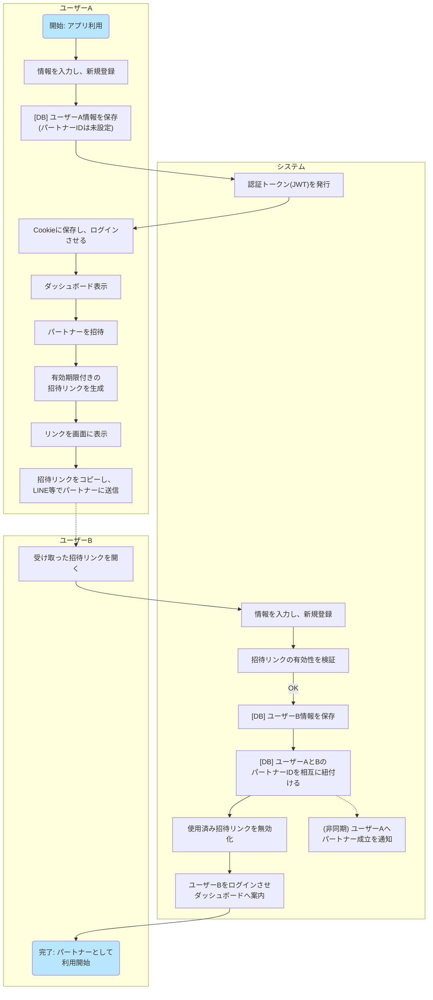
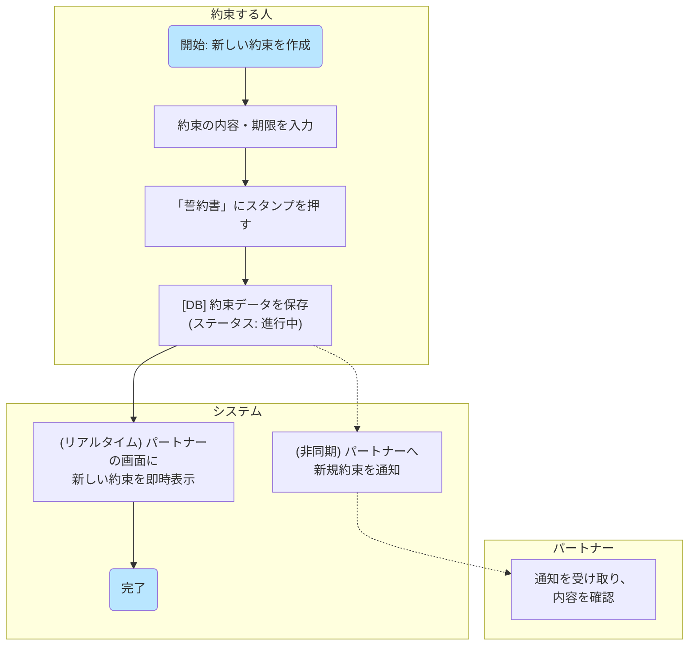
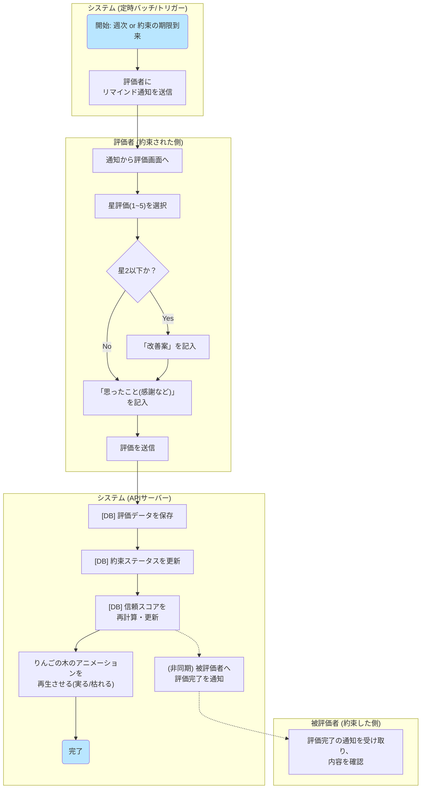
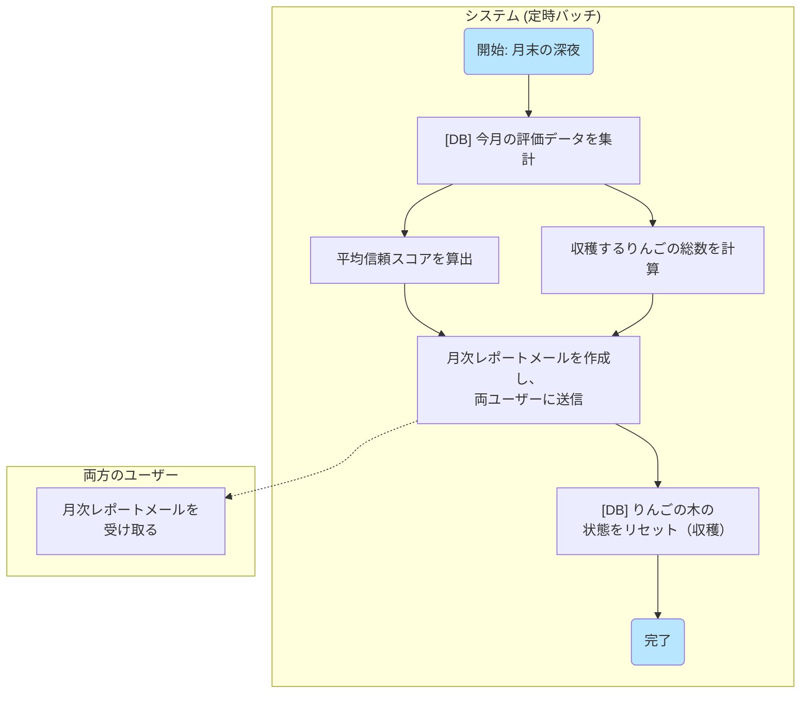

# yubikirigennmann

# 業務フロー

### フロー1：新規ユーザー登録 〜 パートナー招待

* **概要：** 新規ユーザー（ユーザーA）が登録し、パートナー（ユーザーB）を招待して、二人のアカウントがアプリ上で紐づくまでの流れです。

### フロー2：約束の登録から 〜 誓約

* **概要：** 新しい約束を登録し、「誓約書」にサインすることで、二人の間で約束が共有される流れです。

### フロー3：約束の評価

* **概要：** システムからの通知をきっかけに、約束された側（評価者）が約束を評価し、その結果が相手（被評価者）に伝わるまでの流れです。

### フロー4：月末の月次レポート

* **概要：** ユーザーの操作を介さず、月末にシステムが自動でその月の活動を集計し、レポートとしてユーザーにフィードバックする流れです。

