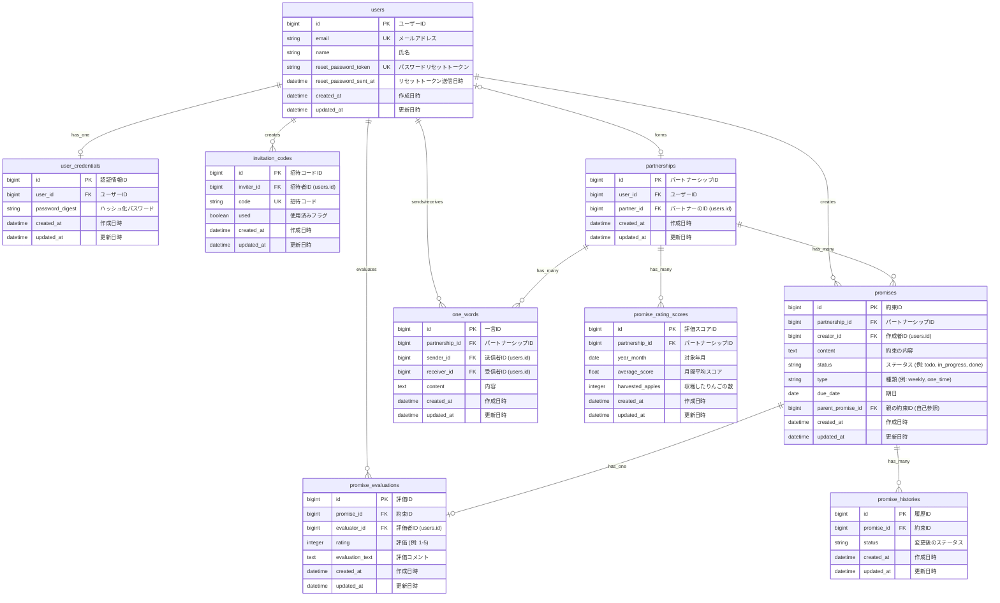

## 概要
「ゆびきりげんまん」は大切な人との約束を守り、  
すれ違いをなくすことで関係性の向上をサポートするサービスです。

## オリジナルプロダクトのURL
<https://yubikirigenman.com>

## サービスへの想い
本プロダクトは、二人の約束事を大切にし、  
恋人、夫婦の関係性をより良くしたい人に向けてすれ違いをなくす手伝いをしたい　 
という想いから開発をしました。  

人と人の関係性において最も大切なことが信頼だと考えています。  
そしてその信頼を形成するために必要なのが約束を守ること。  

ただ、本人が約束を守れたと思っていても  
『相手からしたら守れてなかった』となれば意味がありません。  

自分自身も上記の経験をしたことがあったため本プロダクトでは、  

相手から約束が守れてるかの評価をしてもらい  
『約束を守ったと思っていてができてなかった』というすれ違いを無くすサポートをします。  

またタスク管理ツールのように約束を一覧で管理できるようにすることで  
「そんなこと言ったっけ？」と言ったすれ違いも解消します。  

相手との信頼を形成する上で大事なのは相手から見たときの評価です。  

本プロダクトが相手からの評価を可視化し、  
お互いがお互いのために約束を守り信頼関係を形成していく。  

そして関係性の向上によって世のパートナー達の幸福度を上げる。  

そのサポートができることを目指しています。

## 画面キャプチャ

### ログイン
https://github.com/user-attachments/assets/9edde5a7-742e-4bcf-a28e-08748680feac

### 新規登録
https://github.com/user-attachments/assets/fc836e7d-83be-45c7-a8ed-6defbc5a572f

### パートナーシップの作成
https://github.com/user-attachments/assets/872d7dab-d200-41bb-a4b4-c8a6a7b63d38

### パートナー解消
https://github.com/user-attachments/assets/e60a4229-6064-4058-b9e4-585b50ab4ceb

### 約束作成
https://github.com/user-attachments/assets/946e5625-9fe3-4e95-a595-1cfbd9070702

### 約束の編集削除
https://github.com/user-attachments/assets/3d4cedc7-3b8a-4ad2-a840-3f280b75401d

### 約束の評価
https://github.com/user-attachments/assets/8130f2d1-9534-4601-abef-d3754f484190

### 一言送信
https://github.com/user-attachments/assets/5d90cd64-c6ca-4ee8-ae4b-6b8a5bbf247a

### 過去の約束の過去検索
https://github.com/user-attachments/assets/3c06ddfc-dde0-4a5c-b115-a8546b00f95a

### もらった一言の過去検索
https://github.com/user-attachments/assets/30f6e2fc-7bf2-4bcb-9cff-43fe3e514a0b

## 使用技術

| Category       | Technology Stack                                                                          |
| :------------- | :---------------------------------------------------------------------------------------- |
| **Frontend**     | TypeScript (`~5.8.3`), React (`^19.1.0`), CSS, Vite                                       |
| **Backend**      | Ruby (`3.4.5`), Ruby on Rails (`~> 7.2.2, >= 7.2.2.1`)                                    |
| **Infrastructure** | Amazon Web Services (S3, CloudFront, EC2, RDS, Route 53, ALB, ECR), Sentry, Docker, Docker Compose |
| **Database**     | MySQL (`8.4`)                                                                             |
| **Testing**      | RSpec, ESLint                                                                             |
| **CI/CD**        | GitHub Actions                                                                            |
| **etc.**         | draw.io, Git, GitHub                                                                      |

## ER図

## インフラ構成図

## 機能一覧
- 会員登録、ログイン/ログアウト
- パートナー招待機能
- 約束の作成/削除/編集(内容、期日)
- 約束の一覧表示(自分、パートナー、二人の約束)
- 約束の評価(５段階評価、コメント)
- 過去の評価された約束の一覧表示(自分、パートナー、二人の約束)
- 評価待ちの約束の一覧表示、通知（自分）
- 1ヶ月の信頼スコアの表示
- 約束の評価と数によって『ふたりの記録』の画面が変化
- 感謝やあの時言えなかったことを伝える『ちょっと一言』機能
- 相手からもらった一言の一覧表示、通知（自分）
- メールによる新規登録の完了の通知
- メールによる約束評価のリマインド
- メールによる1ヶ月のレポート送信

## 技術的な工夫
- バックエンドをAPIとして、フロントエンドと分離し、S3、CloudFrontを活用したSPA構成にすることでページ遷移の高速化と低コストで運用を実現
- モデルスペックとリクエストスペックでのRSpecテストを実装し、ビジネスロジックとサービス全体の期待動作を保証(ラインカバレッジ90%以上維持) 
- ALBを使いMulti-AZにまたがって配置されたEC2インスタンスに負荷を分散することで単一障害点を排除し、フェイルオーバーを用いることでサービスが停止しにくい可用性の高い構成の実現

## ユーザー目線での工夫
- モーダルを適切に使用することで入力する場所をわかりやすくし、見やすい画面の実現
- 信頼スコアの表示やレポートなどといったやったことの可視化によってモチベーションの維持
- 必要最低限の情報量に限定した画面によってユーザーが迷わず分かりやすい画面の実現
