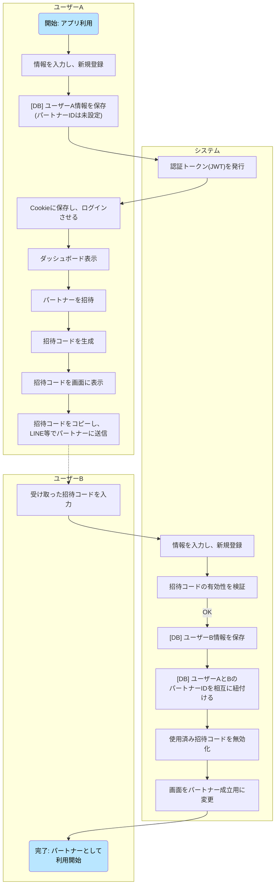
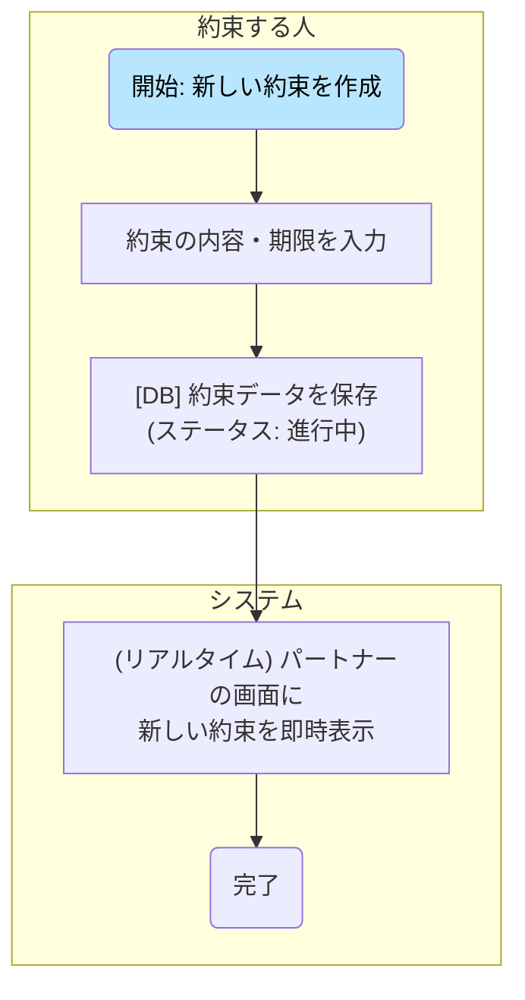
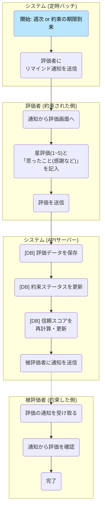
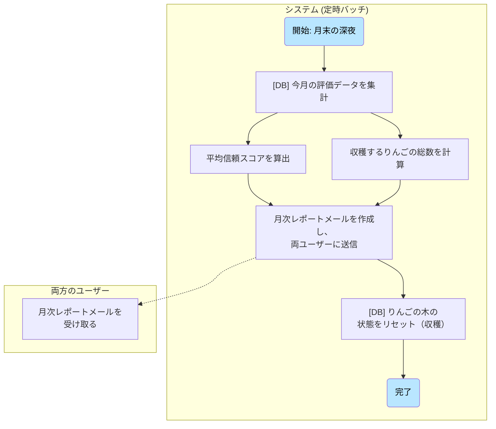
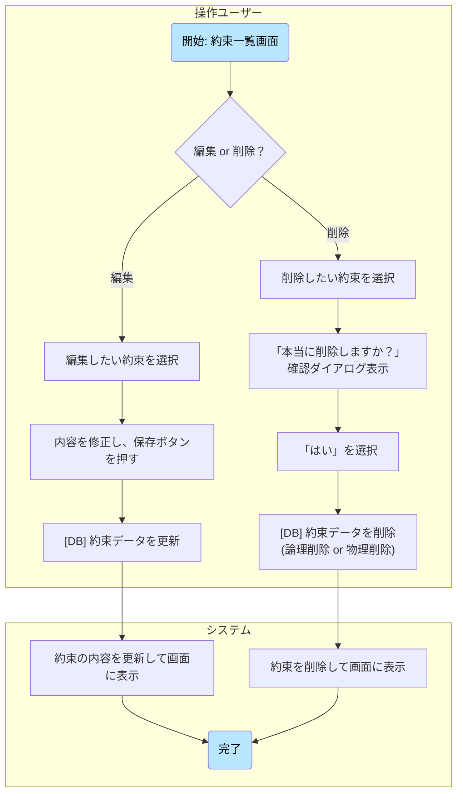
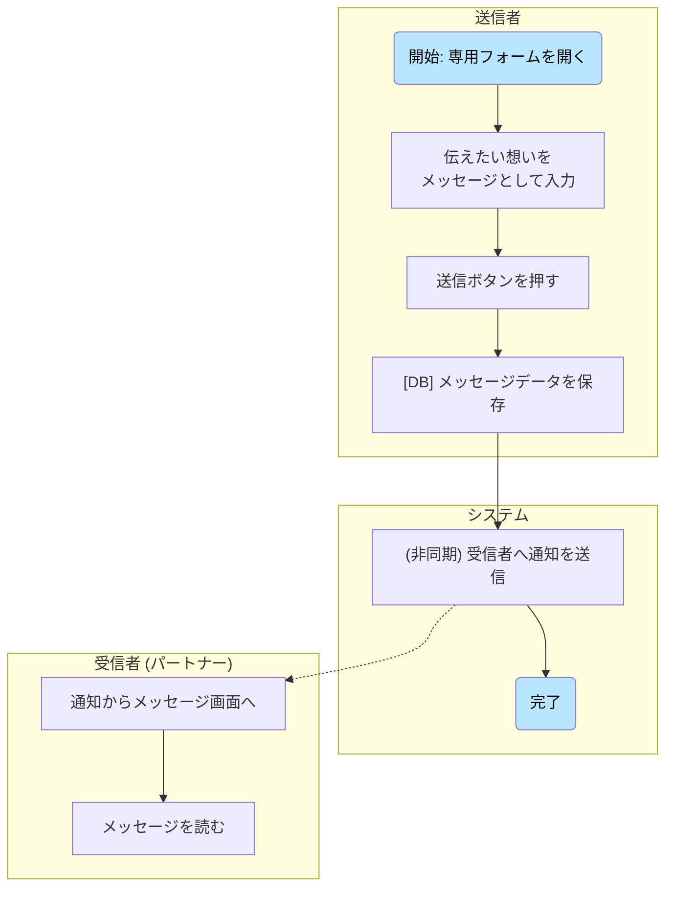
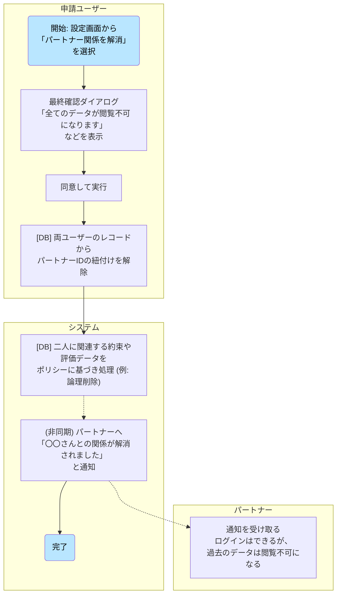
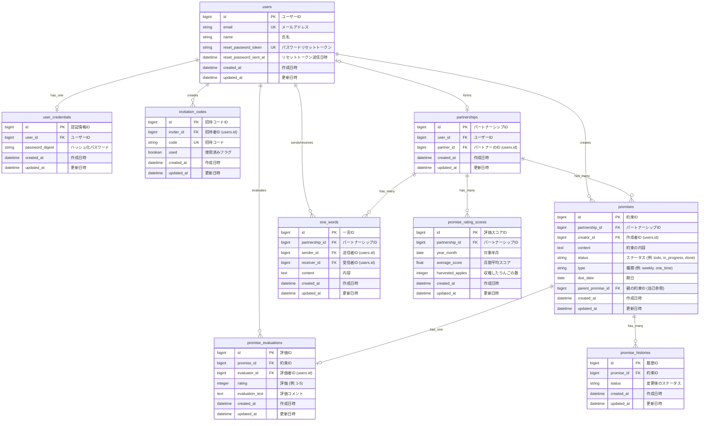
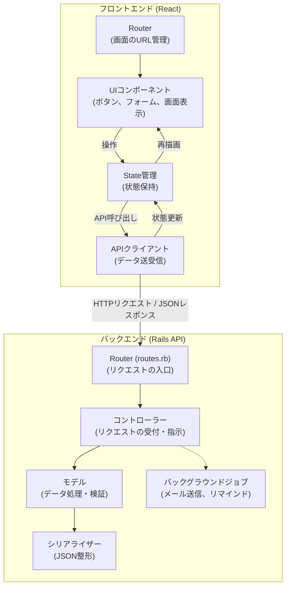

# 画面遷移図

# 業務フロー

### フロー1：新規ユーザー登録 〜 パートナー招待

* **概要：** 新規ユーザー（ユーザーA）が登録し、パートナー（ユーザーB）を招待して、二人のアカウントがアプリ上で紐づくまでの流れです。

### フロー2：約束の作成

* **概要：** 新しい約束を作成し、二人の間で約束が共有される流れです。

### フロー3：約束の評価

* **概要：** システムからの通知をきっかけに、約束された側（評価者）が約束を評価し、その結果が相手（被評価者）に伝わるまでの流れです。

### フロー4：月末の月次レポート

* **概要：** ユーザーの操作を介さず、月末にシステムが自動でその月の活動を集計し、レポートとしてユーザーにフィードバックする流れです。

### フロー5：約束の編集・削除

* **概要：** 一度作成した約束の内容を変更したり、取り消したりする際の基本的な操作フローです。

### フロー6：「ちょっと一言」フォーム

* **概要：** 約束の評価とは別に、日々の感謝や言えなかった想いを伝える、もう一つのコミュニケーション機能のフローです。

### フロー7：パートナー関係の解消

* **概要：** イレギュラーケースの中で二人のデータがどう扱われるかを明確にするためのフローです。

# ワイヤーフレーム
[ゆびきりげんまん.pdf](https://github.com/user-attachments/files/21178378/default.pdf)

# ER 図

# システム構成図(アプリケーションレイヤーのみ)

# インフラ構成図

