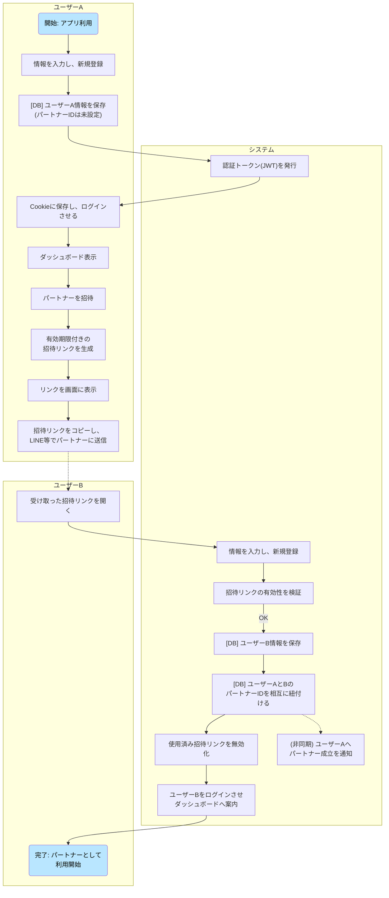
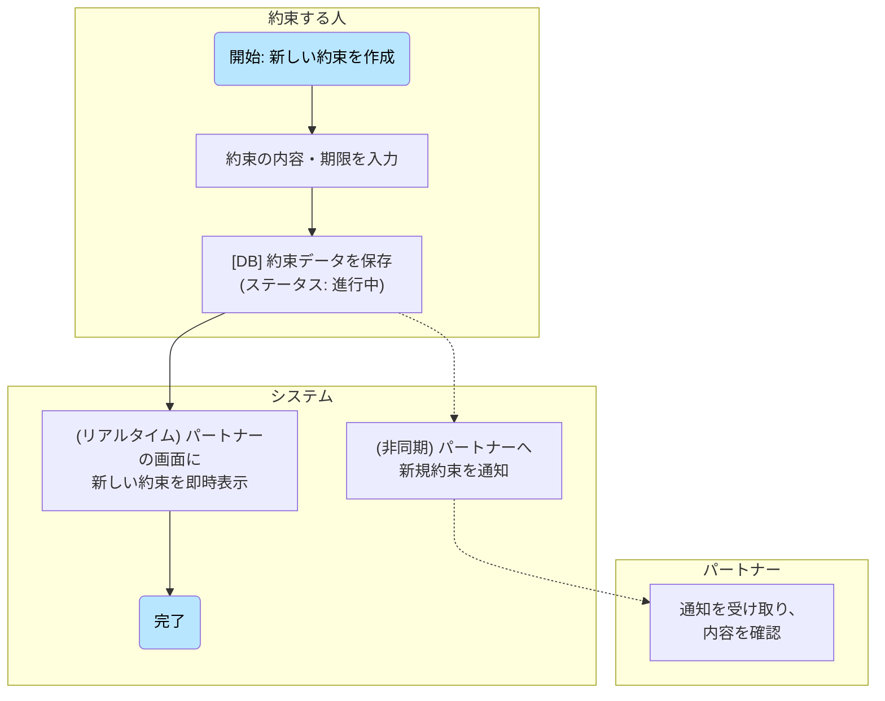
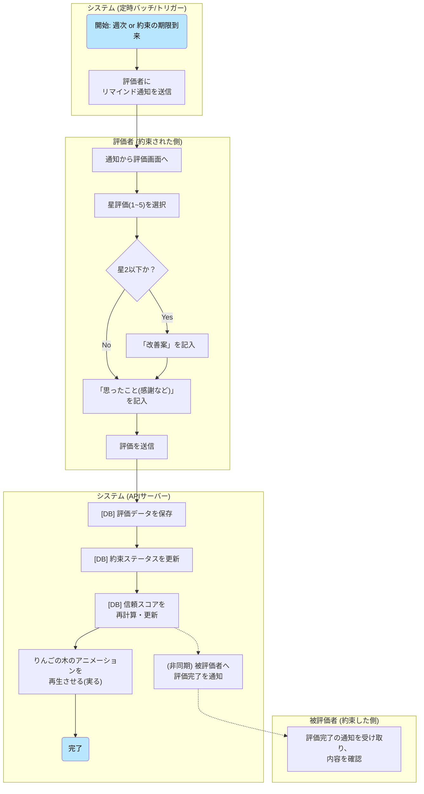
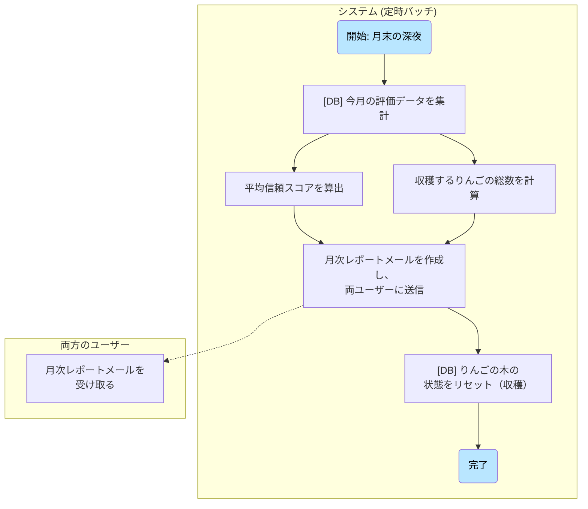
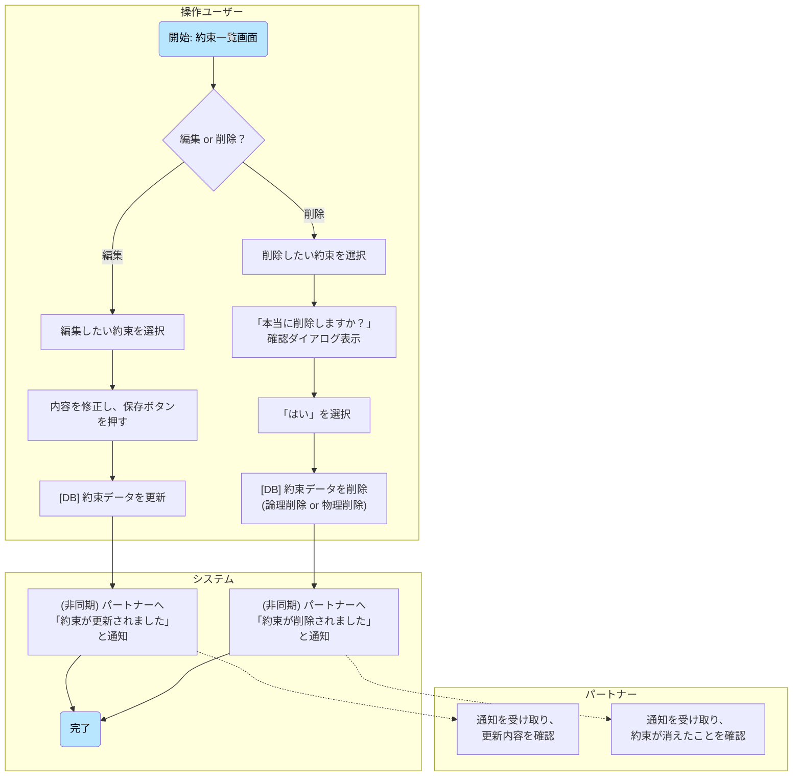
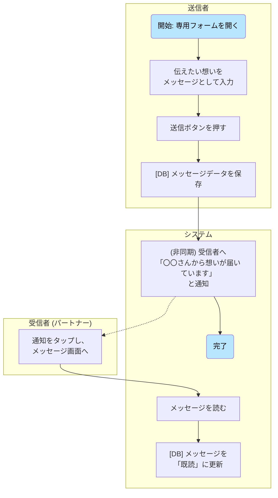
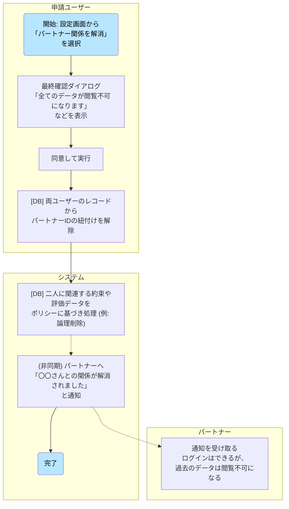

# 画面遷移図

# 業務フロー

### フロー1：新規ユーザー登録 〜 パートナー招待

* **概要：** 新規ユーザー（ユーザーA）が登録し、パートナー（ユーザーB）を招待して、二人のアカウントがアプリ上で紐づくまでの流れです。

### フロー2：約束の登録から 〜 誓約

* **概要：** 新しい約束を登録し、「誓約書」にサインすることで、二人の間で約束が共有される流れです。

### フロー3：約束の評価

* **概要：** システムからの通知をきっかけに、約束された側（評価者）が約束を評価し、その結果が相手（被評価者）に伝わるまでの流れです。

### フロー4：月末の月次レポート

* **概要：** ユーザーの操作を介さず、月末にシステムが自動でその月の活動を集計し、レポートとしてユーザーにフィードバックする流れです。

### フロー5：約束の編集・削除

* **概要：** 一度作成した約束の内容を変更したり、取り消したりする際の基本的な操作フローです。

### フロー6：「想いを伝える」フォーム

* **概要：** 約束の評価とは別に、日々の感謝や言えなかった想いを伝える、もう一つのコミュニケーション機能のフローです。

### フロー7：パートナー関係の解消

* **概要：** イレギュラーケースの中で二人のデータがどう扱われるかを明確にするためのフローです。

# ワイヤーフレーム
[ゆびきりげんまん.pdf](https://github.com/user-attachments/files/21178378/default.pdf)
# テーブル定義書（もしくは ER 図）
erDiagram
    users ||--o{ partnerships : "has one"
    partnerships ||--|{ promises : "has many"
    partnerships ||--|{ notes : "has many"
    users ||--o{ promises : "creates"
    users ||--o{ evaluations : "evaluates"
    users ||--o{ notes : "sends"
    promises ||--|{ evaluations : "has many"

    users {
        int id "PK"
        string email
        string password_digest
        string name
        string profile_image_url
    }

    partnerships {
        int id "PK"
        string invite_token
        string status
    }

    promises {
        int id "PK"
        int partnership_id "FK"
        int creator_id "FK"
        string title
        text description
        string promise_type
        date due_date
        string status
    }

    evaluations {
        int id "PK"
        int promise_id "FK"
        int evaluator_id "FK"
        int score
        text comment
        text improvement_plan
    }

    notes {
        int id "PK"
        int partnership_id "FK"
        int sender_id "FK"
        text content
        boolean is_read
    }
# システム構成図
作成中です

