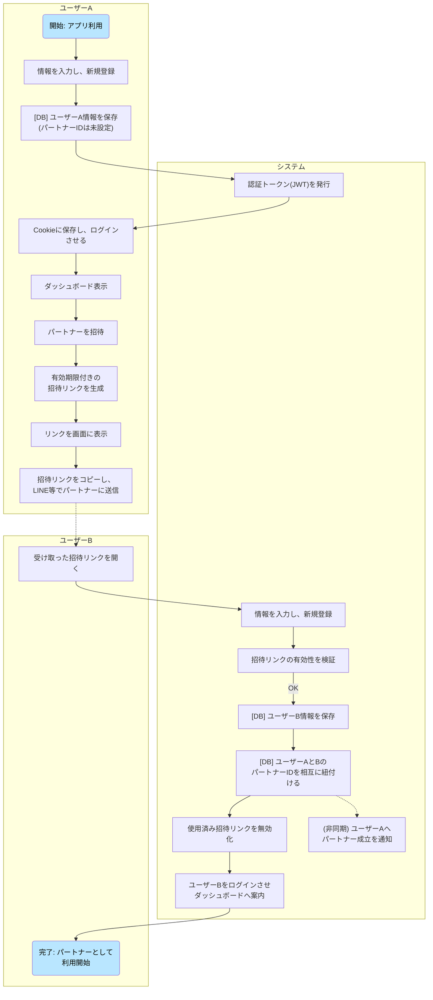
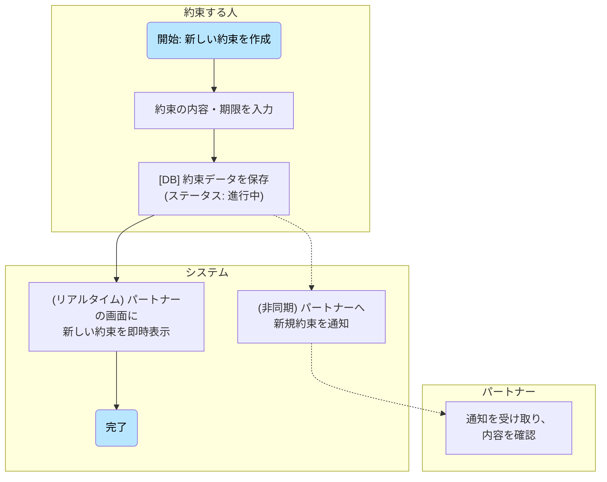
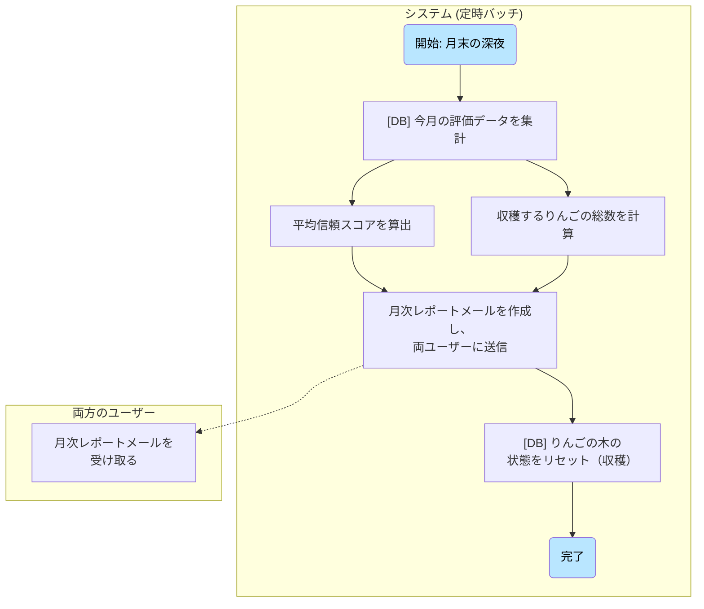
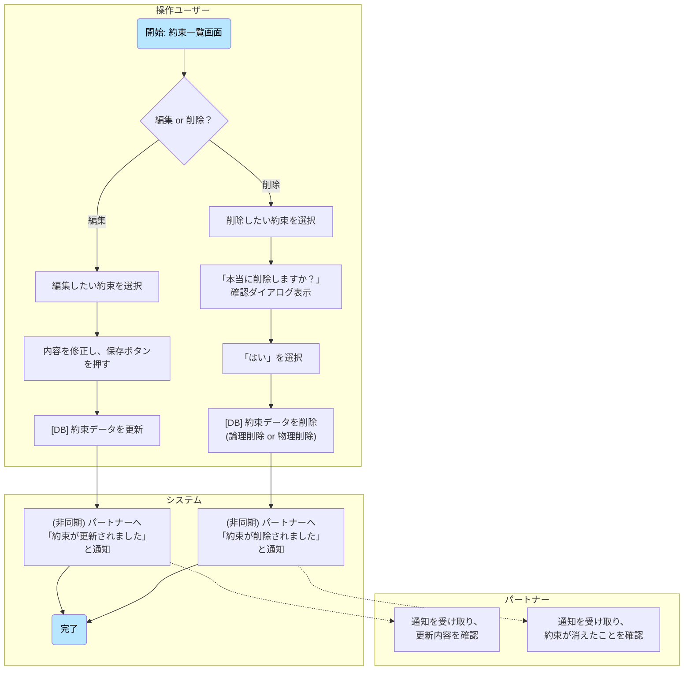
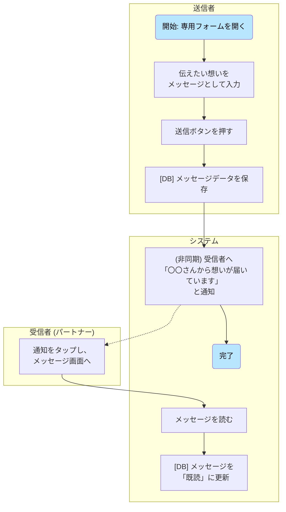
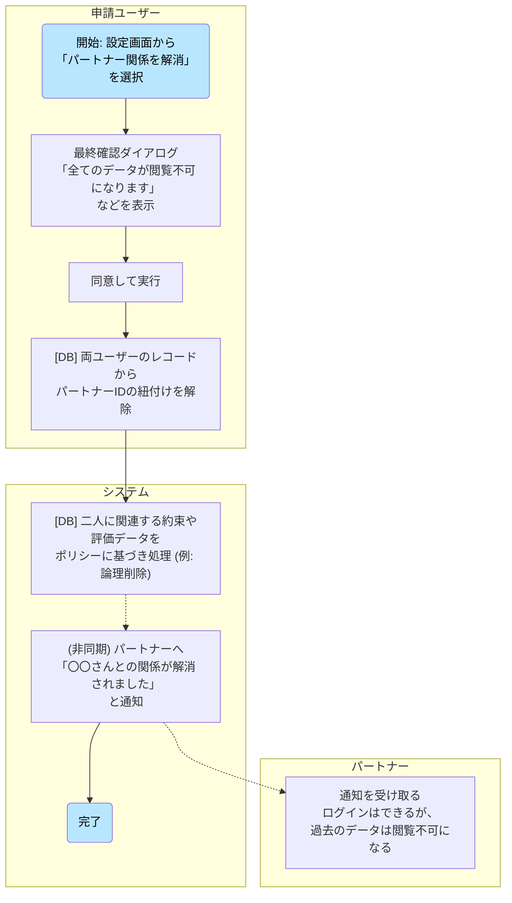
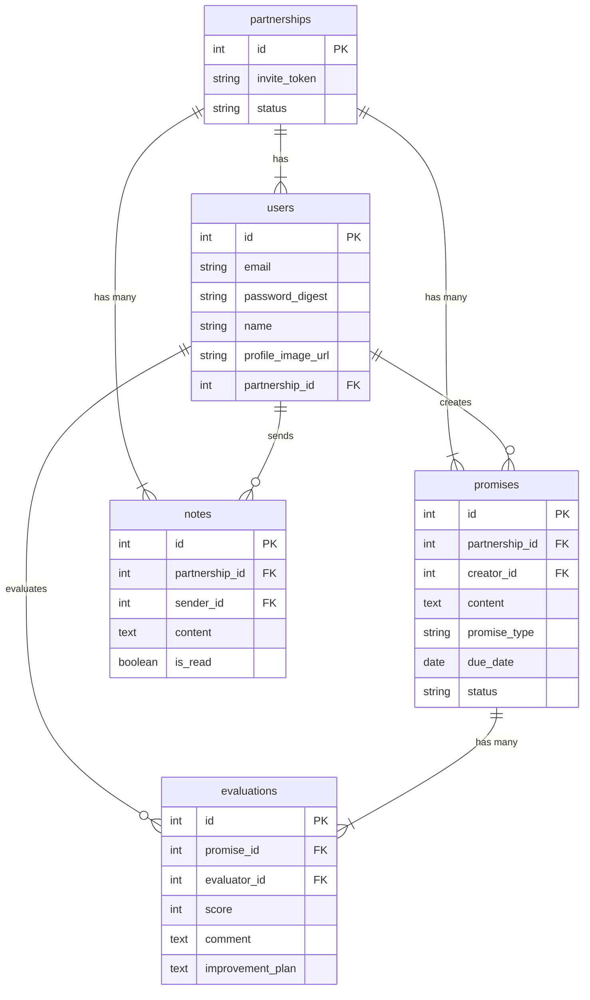
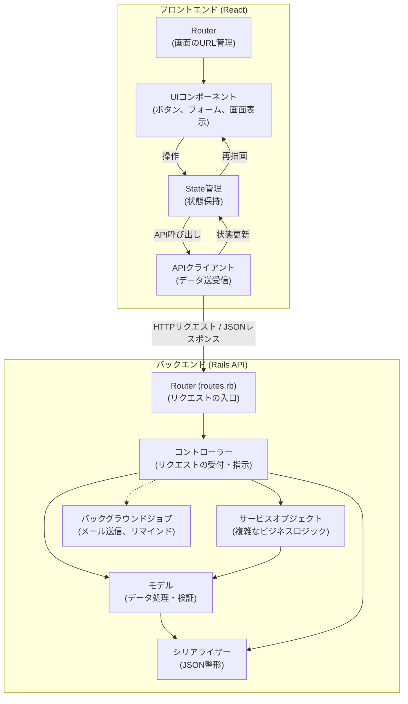

# 画面遷移図


# 業務フロー

### フロー1：新規ユーザー登録 〜 パートナー招待

* **概要：** 新規ユーザー（ユーザーA）が登録し、パートナー（ユーザーB）を招待して、二人のアカウントがアプリ上で紐づくまでの流れです。


### フロー2：約束の登録から 〜 誓約

* **概要：** 新しい約束を登録し、「誓約書」にサインすることで、二人の間で約束が共有される流れです。

### フロー3：約束の評価

* **概要：** システムからの通知をきっかけに、約束された側（評価者）が約束を評価し、その結果が相手（被評価者）に伝わるまでの流れです。
```mermaid

graph TD
    subgraph "システム (定時バッチ)"
        T1("開始: 週次 or 約束の期限到来") --> T2 ["評価者に<br>リマインド通知を送信"]
    end

    subgraph "評価者 (約束された側)"
        T2 --> U1 ["通知から評価画面へ"]
        U1 --> U2 ["星評価(1~5)と<br>「思ったこと(感謝など)」を記入"]
        U2 --> U5 ["評価を送信"]
    end

    subgraph "システム (APIサーバー)"
        U5 --> S1 ["[DB] 評価データを保存"]
        S1 --> S2 ["[DB] 約束ステータスを更新"]
        S2 --> S3 ["[DB] 信頼スコアを<br>再計算・更新"]
        S3 --> S4 ["りんごの木のアニメーションを<br>再生させる(実る)"]
        S4 --> D1 {"評価が星2以下か？"}
        D1 -- No --> C1("完了")
        D1 -- Yes --> S5 ["(非同期) 被評価者へ<br>改善案の入力を要求"]
    end

    subgraph "被評価者 (約束した側)"
        S5 -.-> E1 ["改善案の要求通知を受け取る"]
        E1 --> E2 ["評価内容を確認し、<br>改善案を記入・送信"]
        E2 --> E3 ["[システム] 改善案をDBに保存"]
        E3 --> E4("完了")
    end

    style T1 fill:#B9E6FF,color:#000
    style C1 fill:#B9E6FF,color:#000
    style E4 fill:#B9E6FF,color:#000
```
### フロー4：月末の月次レポート

* **概要：** ユーザーの操作を介さず、月末にシステムが自動でその月の活動を集計し、レポートとしてユーザーにフィードバックする流れです。

### フロー5：約束の編集・削除

* **概要：** 一度作成した約束の内容を変更したり、取り消したりする際の基本的な操作フローです。

### フロー6：「ちょっと一言」フォーム

* **概要：** 約束の評価とは別に、日々の感謝や言えなかった想いを伝える、もう一つのコミュニケーション機能のフローです。

### フロー7：パートナー関係の解消

* **概要：** イレギュラーケースの中で二人のデータがどう扱われるかを明確にするためのフローです。

# ワイヤーフレーム
[ゆびきりげんまん.pdf](https://github.com/user-attachments/files/21178378/default.pdf)


# ER 図


# システム構成図(アプリケーションレイヤーのみ)

